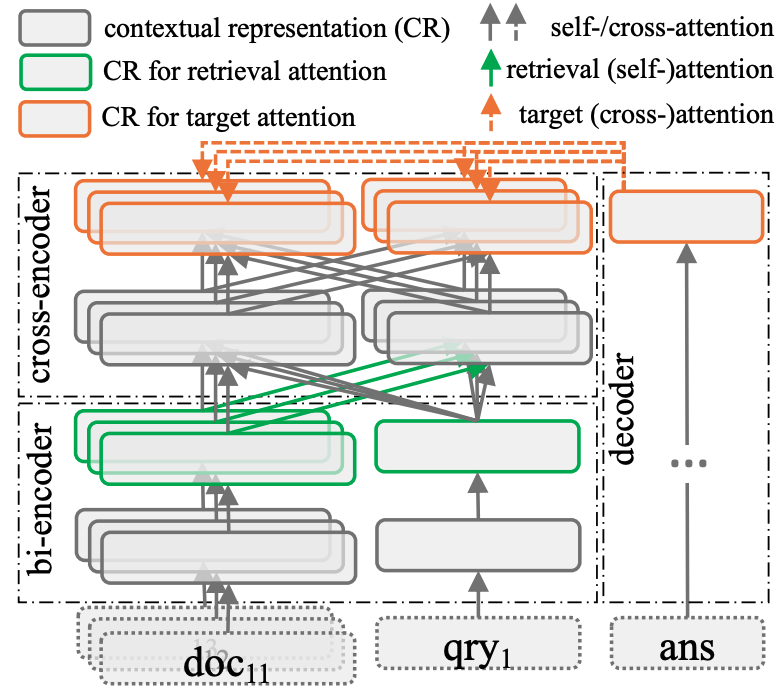

# <ins>Re</ins>trieval as <ins>Att</ins>ention (ReAtt)

This repository contains the code, models, and data for the paper
[Retrieval as Attention: End-to-end Learning of Retrieval and Reading within a Single Transformer](https://arxiv.org/pdf/2212.02027.pdf) by Zhengbao Jiang*, Luyu Gao*, Jun Araki, Haibo Ding, Zhiruo Wang, Jamie Callan, Graham Neubig.

## Overview

ReAtt is a T5-based retrieval-augmented model for knowledge-intensive tasks (e.g., QA) that performs retrieval using attention and learns retrieval and reading in a fully end-to-end way only relying on end-task annotations.

<p align="center">
  
</p>

## Install environment with Conda
Create a conda env with the name `reatt` using `./setup.sh`.

## Quick start

### Models
- [neulab/reatt-large-nq](https://huggingface.co/neulab/reatt-large-nq): ReAtt trained on NQ (starting from DPR documents).
- [neulab/reatt-large-nq-fiqa](https://huggingface.co/neulab/reatt-large-nq-fiqa): `neulab/reatt-large-nq` adapted on FiQA.
- [neulab/reatt-large-nq-bioasq](https://huggingface.co/neulab/reatt-large-nq-bioasq): `neulab/reatt-large-nq` adapted on BioASQ.

### Download pre-built embeddings
Download the pre-built embeddings from [Google Drive](https://drive.google.com/drive/u/1/folders/1NXmWudqhHaS32Ebr0ch-f8Ioymcy0xyM). You can download it programmatically with [gdrive](https://anaconda.org/conda-forge/gdrive) using `gdrive download -r 1NXmWudqhHaS32Ebr0ch-f8Ioymcy0xyM`.

### Retrieval and generation on FiQA dataset
```python
from transformers import AutoTokenizer
from beir.datasets.data_loader import GenericDataLoader
from reatt.model import ReAttConfig, ReAttForConditionalGeneration
from reatt.data import Dataset

model_name = 'neulab/reatt-large-nq-fiqa'
retrieval_corpus = 'reatt_download/reatt-large-nq-fiqa/fiqa'
fiqa_data = 'reatt_download/fiqa'
tokenizer = AutoTokenizer.from_pretrained(model_name)
config = ReAttConfig.from_pretrained(model_name, retrieval_corpus=retrieval_corpus)
model = ReAttForConditionalGeneration.from_pretrained(model_name, config=config).cuda()

question = 'What is considered a business expense on a business trip?'
encoded = tokenizer.batch_encode_plus(
  [Dataset.get_question(question)],
  max_length=128,
  padding=True,
  truncation=True,
  return_tensors='pt')
encoded = {k: v.cuda() for k, v in encoded.items()}

# === only retrieve ===
rank = model.encoder.retriever.retrieve(**encoded)[0]  # top-100 doc tuples <doc_id, score>
corpus, queries, qrels = GenericDataLoader(data_folder=fiqa_data).load(split='test')
print(corpus[rank[0][0]]['text'], rank[0][1], sep='\n')  # content of the top-1 doc and its score
# Food is almost never a valid expense. Reason for it is simple - if you were not conducting business you would have to eat too. ...
# 224.07415771484375

# === retrieve then generation ===
prediction = model.generate(**encoded, search_kwargs={'doc_topk': 10, 'max_length': 512}, max_length=512)[0]
print(tokenizer.decode(prediction, skip_special_tokens=True))
# "It depends on what the ""true"" reason for the trip is. If you decide to deduct the trip as a business expense ...
```

## Experiments

### Inference: retrieval
Save embeddings of all document tokens from `dataset` using `model`.
```shell
python inference.py \
  --task index \
  --model neulab/reatt-large-nq-fiqa \
  --dataset reatt_download/fiqa \
  --output output/fiqa \
  --max_context_len 512
```

Load `model` and embeddings from `retireval_corpus`, retrieve top-100 documents for queries from the `dataset`, and compute retrieval metrics (nDCG, MAP, recall precision).
```shell
python inference.py \
  --task retrieve \
  --model neulab/reatt-large-nq-fiqa \
  --retireval_corpus reatt_download/reatt-large-nq-fiqa/fiqa \
  --dataset reatt_download/fiqa \
  --doc_topk 100 \
  --max_query_len 128
```

## Inference: retrieval-augmented generation

Load `model` and embeddings from `retireval_corpus`, retrieve top-10 documents for queries from the `dataset`, and generate answers.
```shell
python inference.py \
  --task generate \
  --model neulab/reatt-large-nq-fiqa \
  --retireval_corpus reatt_download/reatt-large-nq-fiqa/fiqa \
  --dataset reatt_download/fiqa \
  --doc_topk 10 \
  --max_query_len 128 \
  --max_context_len 512 \
  --max_generation_len 512
```

## Reference

```bibtex
@inproceedings{jiang-etal-2022-reatt,
    title = {Retrieval as Attention: End-to-end Learning of Retrieval and Reading within a Single Transformer},
    author = {Zhengbao Jiang and Luyu Gao and Jun Araki and Haibo Ding and Zhiruo Wang and Jamie Callan and Graham Neubig},
    booktitle = {Conference on Empirical Methods in Natural Language Processing (EMNLP)},
    address = {Abu Dhabi, UAE},
    month = {December},
    year = {2022}
}
```
